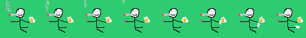
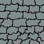
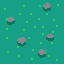

# 03_PIXEL_FORGE

> **Дата:** 22.09.26
> **Студент:** Кудрявцев Александр Матросов Сергей

## ОПИСАНИЕ
Напишите описание вашей работы 

## СОЗДАННЫЕ АССЕТЫ

### 1. Персонаж и Враг
* **Игрок**: [опишите, кого Вы нарисовали]
* **Враг**: [опишите врага]
* **Анимация**: Состоит из [число] кадров.

### 2. Окружение
* Создан тайл пола и стены.
* Создан предмет для сбора: [Сундук/Монета/Ключ].

## ПРЕВЬЮ ГРАФИКИ

